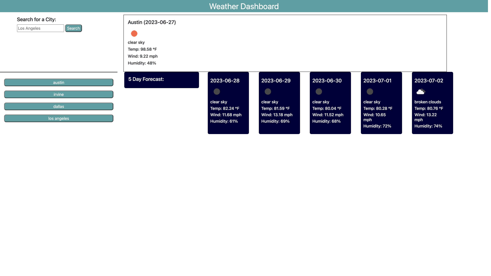
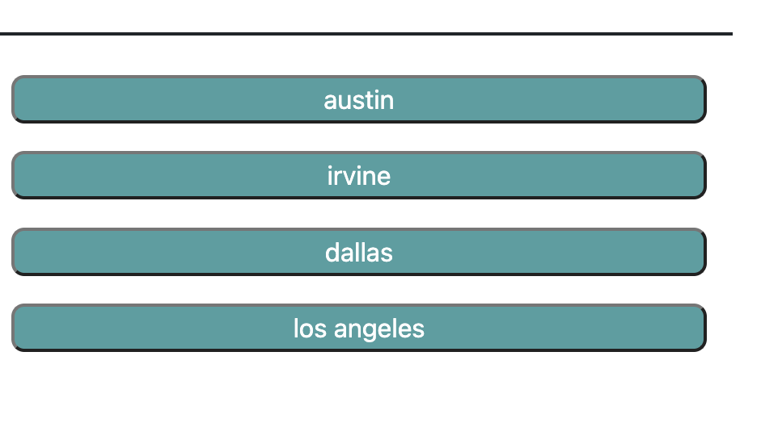

# Weather-Forecast

## Table of Contents

- [Installation](#installation)
- [Usage](#usage)
- [Credits](#credits)
- [License](#license)

## Description
- This project was created to be able to test my ability and knowledge of implementing server side APIs. Learning how to use a fetch call and utilizing the returned data to make a webpage dynamic and responsive proved to be a challenge. Overall, implementing these ideas helped better my understanding of JavaScript, dot notation, local storage, and server side APIs. This project also really aided in furthering my understanding of the numerous powerful and useful applications that can be built with server side APIs.

## Installation
- N/A

## Usage

- Navigate to: https://alexanderolivares13.github.io/Weather-Forecast

- The user will be taken to the landing page, if the user has not used the site before then a default city will be loaded and display the weather forecst.

- Screenshot of the deployed site: 

- The user will be able to search any city within the United States and the website will display the current weather and the next 5 day forecast. Among the information provided is the Temperature, Wind Speed, Humidity, a description of the weather, and a respective weather icon.

- As the user searches for cities, buttons will be generated on the left side of the page. In descending sequence of most recently searched. These buttons can be clicked on to display the weather information for that city once again, and will be removed once the page is reloaded.

- As shown below:

## Credits

- Jquery Library: https://code.jquery.com/jquery-3.7.0.min.js

- DayJS: https://day.js.org

- Bootstrap CSS Framework: https://getbootstrap.com

## License

Please refer to the LICENSE in the repo.